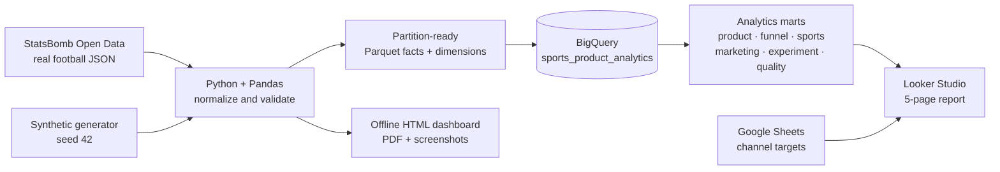
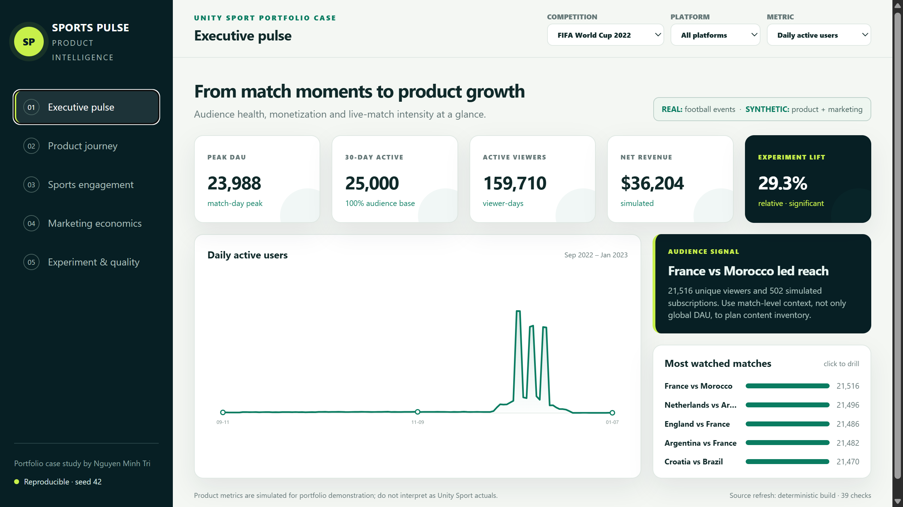
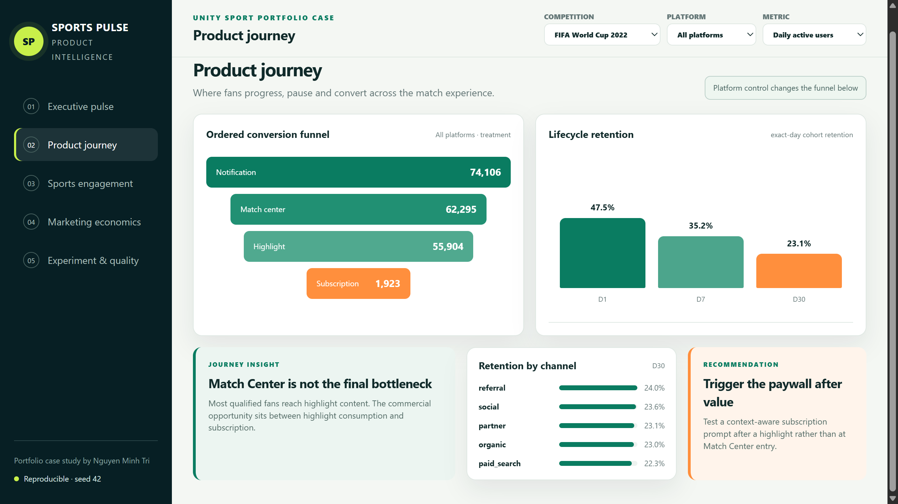
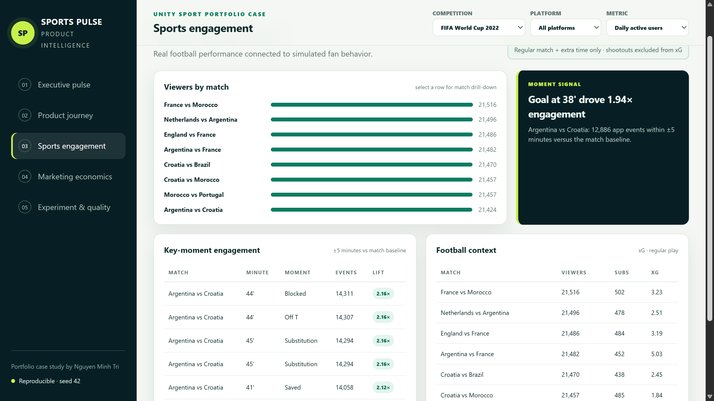
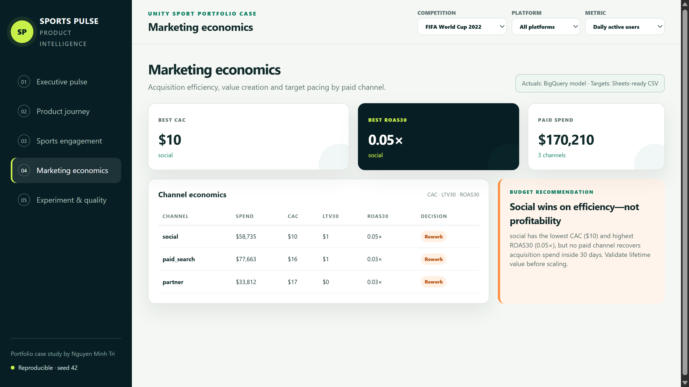
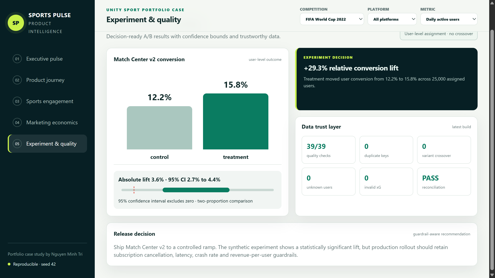

# Sports Product Analytics — BigQuery + Looker Studio

A portfolio case study answering one product question:

> Which matches, moments and content journeys drive fan engagement and subscription conversion?

The project joins **real FIFA World Cup 2022 football events** from [StatsBomb Open Data](https://github.com/statsbomb/open-data) with **clearly labelled, deterministic synthetic product and marketing events**. It demonstrates BigQuery modelling, advanced SQL, product analytics, experimentation, data quality and a five-page dashboard designed for a sports product team.

## Portfolio proof

| Capability | Evidence in this repository |
|---|---|
| BigQuery SQL | 9 documented workflows covering windows, cohorts, funnels, sports, marketing, A/B testing and reconciliation |
| Product analytics | DAU/MAU, stickiness, D1/D7/D30 retention, churn, ordered funnel and ARPU |
| Football analytics | xG, shots, possession, passing, tackles and engagement around real match moments |
| Experimentation | User-level control/treatment assignment, no crossover, lift and 95% confidence interval |
| Marketing | CAC, LTV30, ROAS30 and a Sheets-ready target blend |
| Engineering | Partition/cluster contracts, deterministic generation, Parquet batch load, tests and CI |

## Dataset at a glance

- 8 real World Cup matches and 31,797 StatsBomb match events
- 25,000 synthetic users and 1,200,000 synthetic app events
- 321 campaign-day rows across 107 days, three paid channels and one reproducible A/B test
- 39 automated data-quality checks
- Seed `42`; no paid API key required

The synthetic layer is a simulation, not Unity Sport data and not client work.

## Architecture



See [the detailed architecture](docs/architecture.md) and [data dictionary](docs/data-dictionary.md).

## Reproduce locally

```powershell
python -m venv .venv
.\.venv\Scripts\Activate.ps1
pip install -e ".[dev,cloud]"

# Fast smoke build: real football data + 50k synthetic app events
python -m sports_product_analytics generate --events 50000 --users 2000 --matches 3

# Portfolio build
python -m sports_product_analytics generate --events 1200000 --users 25000 --matches 8 --seed 42
python -m sports_product_analytics build-extracts

ruff check .
pytest
sqlfluff lint sql --dialect bigquery
```

The StatsBomb client caches public JSON after the first download. Generated facts are ignored by Git; a fresh clone can reproduce the Parquet outputs without a paid key.

## BigQuery deployment

```powershell
gcloud auth application-default login
python -m sports_product_analytics load-bigquery `
  --project YOUR_PROJECT_ID `
  --dataset sports_product_analytics `
  --location asia-southeast1

python -m sports_product_analytics dry-run --project YOUR_PROJECT_ID
python -m sports_product_analytics build-marts --project YOUR_PROJECT_ID
```

Fact tables are partitioned by date/timestamp and clustered by high-value filters such as `user_id`, `match_id`, `event_name`, competition and channel. Run dry-runs before materialization; recorded bytes processed belong in the query notes for the deployed project.

## SQL workflows

| File | Business workflow |
|---|---|
| [`01_sessionization.sql`](sql/01_sessionization.sql) | 30-minute sessionization with `LAG` and cumulative windows |
| [`02_product_kpis.sql`](sql/02_product_kpis.sql) | DAU, trailing MAU, stickiness, conversion and ARPU |
| [`03_retention_cohort.sql`](sql/03_retention_cohort.sql) | D1/D7/D30 cohort retention and churn |
| [`04_conversion_funnel.sql`](sql/04_conversion_funnel.sql) | Ordered notification → match center → highlight → subscription funnel |
| [`05_sports_engagement.sql`](sql/05_sports_engagement.sql) | Engagement by match and content with football context |
| [`06_football_metrics.sql`](sql/06_football_metrics.sql) | xG, shots, passing, possession, tackles and key-moment lift |
| [`07_marketing_economics.sql`](sql/07_marketing_economics.sql) | CAC, LTV30, ARPU and ROAS by channel |
| [`08_ab_test.sql`](sql/08_ab_test.sql) | A/B lift, z-score and confidence bounds |
| [`09_data_quality.sql`](sql/09_data_quality.sql) | Duplicate, FK, crossover and revenue reconciliation checks |

Every SQL file states the business question, metric definition, expected output and bytes-processed intent.

## Dashboard

The five report pages are:

1. Executive pulse
2. Product journey
3. Sports engagement
4. Marketing economics
5. Experiment & quality

Open the [offline dashboard](dashboard/portfolio-dashboard.html) directly in a browser. It includes working page navigation, metric selection, platform filtering and match-level drill context using the generated extracts.

### Dashboard preview

<p align="center">
  
</p>

<table>
  <tr>
    <td width="50%"><br><strong>02 · Product journey</strong></td>
    <td width="50%"><br><strong>03 · Sports engagement</strong></td>
  </tr>
  <tr>
    <td width="50%"><br><strong>04 · Marketing economics</strong></td>
    <td width="50%"><br><strong>05 · Experiment &amp; quality</strong></td>
  </tr>
</table>

The [Looker Studio build guide](dashboard/LOOKER_STUDIO_BUILD_GUIDE.md) maps each chart, parameter, control and calculated field to the BigQuery marts. The public Looker URL is added only after incognito access is verified; no personal-account URL is fabricated here.

## Reproducible findings

These findings come from the latest seed-42 product simulation joined to real football events:

- Match Center v2 increased simulated user conversion from **12.19% to 15.76%**: **+3.57 percentage points**, **+29.25% relative**, with a 95% CI of **+2.71 to +4.43 points**.
- The goal at 38′ in Argentina vs Croatia coincided with **12,886 app events within ±5 minutes**, **1.94×** the match-window baseline.
- France vs Morocco generated the largest simulated reach: **21,516 unique viewers** and **502 subscriptions**.
- Social had the best paid efficiency (**$10.06 CAC**) but only **0.05× ROAS30**; none of the paid channels recovered spend in 30 days.

## Recommendations

1. Ramp Match Center v2 behind cancellation, latency and revenue-per-user guardrails; the experiment is statistically clear but still synthetic.
2. Place the subscription prompt after highlight value is delivered. The largest remaining journey loss occurs between highlight viewing and subscription.
3. Trigger timely content around high-intensity moments, then validate incremental lift with a real holdout. Do not scale paid acquisition until lifetime value—not only 30-day revenue—supports CAC.

The full narrative is in [the case study](docs/case-study.md); a concise delivery script is in [the five-minute walkthrough](docs/interview-walkthrough.md).

## Limitations

- Product, campaign and experiment events are synthetic and intentionally labelled.
- Only eight 2022 World Cup matches are used; league-level comparison needs more competitions and seasons.
- StatsBomb coordinates and event definitions are source-specific.
- The A/B effect is encoded in the simulation to demonstrate analysis mechanics; it is not causal evidence about a live product.
- LTV is a 30-day revenue proxy, not a contractual finance definition.

## License and attribution

Project code is MIT licensed. StatsBomb data is used under the attribution requirements in its open-data repository; StatsBomb data is not redistributed here.
