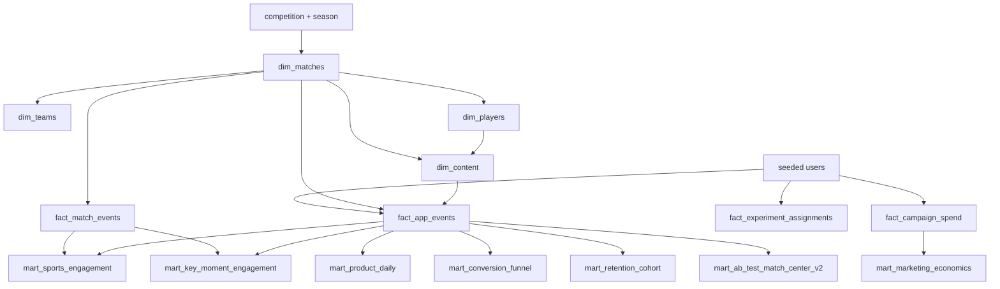

# Architecture and data contracts

## Design choices

This project is deliberately batch-first. It proves analytics modelling and query design without adding a streaming platform or an AI model that the business question does not need.

1. `StatsBombClient` downloads and caches public competition, match, lineup and event JSON.
2. Pandas normalizes stable dimensions and event-grain facts.
3. The seeded generator creates users, sessions, campaign spend and A/B assignment linked to real `match_id`, content, players and timestamps.
4. Validation runs before any Parquet artifact is written.
5. BigQuery loads use Parquet batch jobs with partitioning and clustering from a central contract.
6. SQL materializes small dashboard marts so Looker Studio does not repeatedly scan raw events.

## Data lineage

## Grain and optimization

| Table class | Grain | Partition | Clustering |
|---|---|---|---|
| `fact_app_events` | one product event | `event_date` | `user_id`, `match_id`, `event_name` |
| `fact_match_events` | one StatsBomb event | `event_ts` day | `match_id`, `event_type` |
| `fact_campaign_spend` | campaign-day | `spend_date` | `channel` |
| `dim_matches` | one match | `match_date` | `competition_id` |
| product marts | day/cohort/journey | mart date | dashboard filter dimensions |
| sports marts | match/content or match/team | none | `match_id`, competition/content/team |

Partition filters are expected in ad-hoc exploration. Dashboard charts connect to marts rather than the 1.2-million-row fact whenever possible.

## Source truth boundary

- Real: StatsBomb match, lineup and football-event attributes.
- Synthetic: users, app behavior, campaign economics and experiment outcomes.
- Derived: all marts, metrics, confidence intervals and dashboard recommendations.

This boundary is repeated in the README and dashboard so a reviewer cannot mistake simulation for employment or client evidence.
